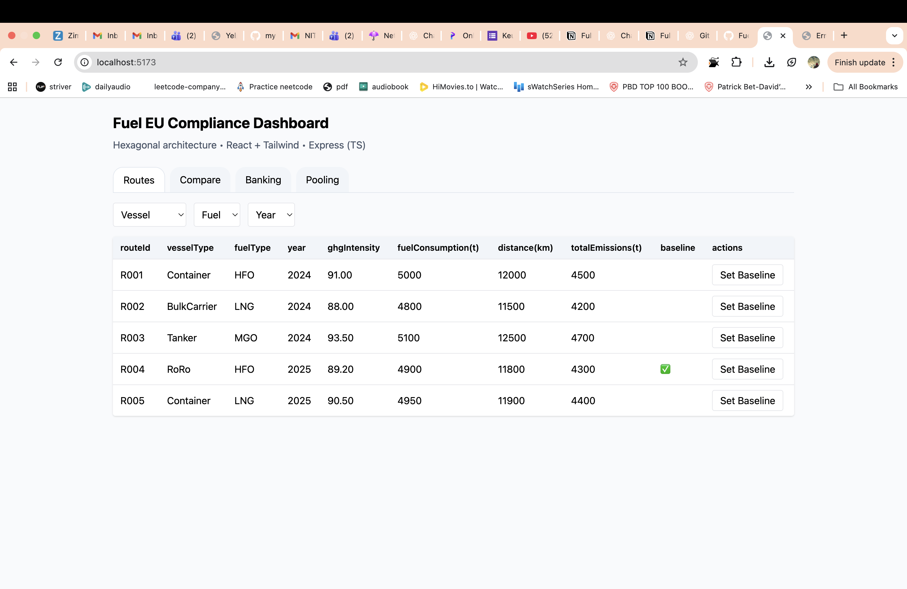
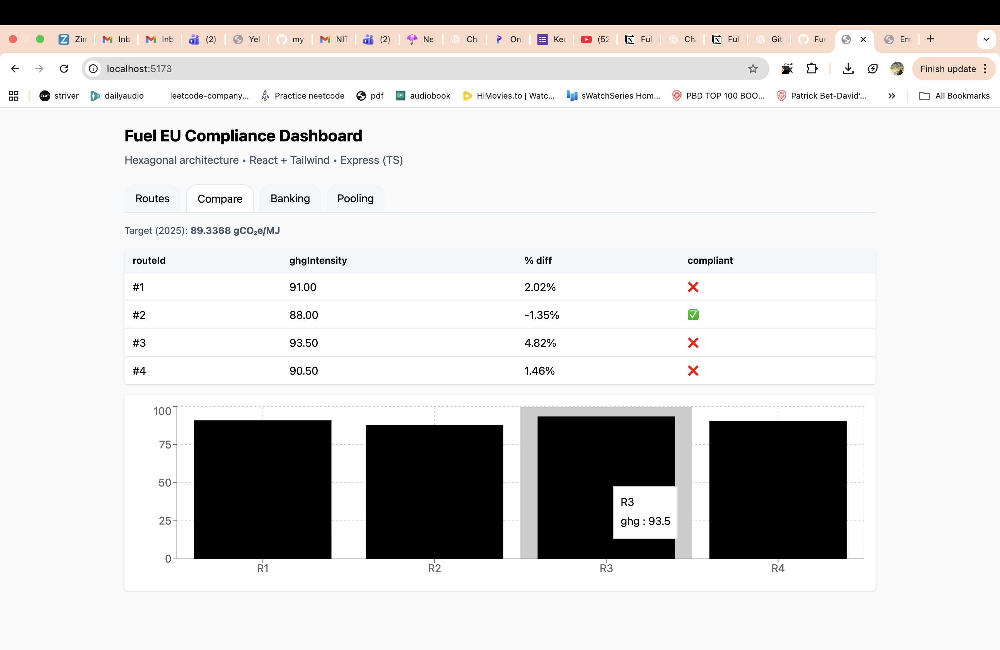
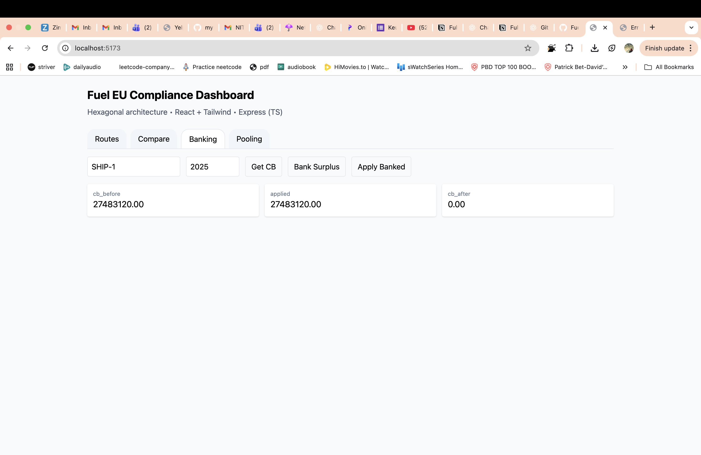
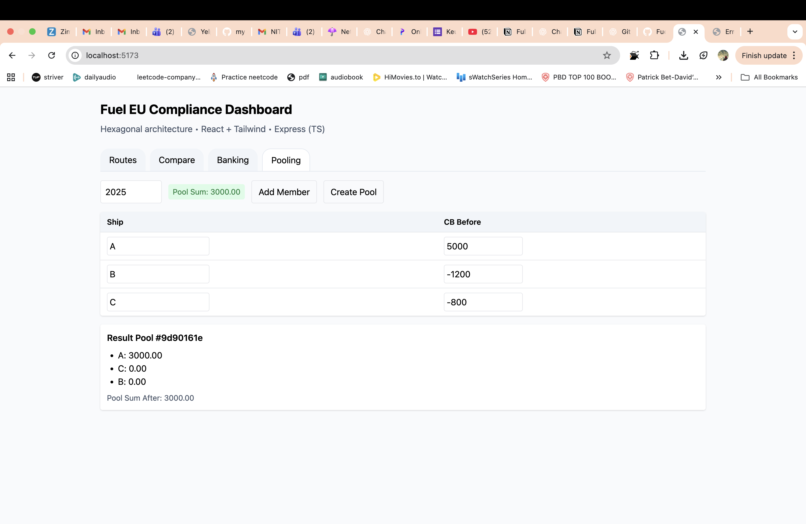

# FuelEU Maritime — Full-Stack Compliance Module

This project is a simplified version of the **FuelEU Maritime Regulation (EU 2023/1805)** compliance system.  
It models ship routes, greenhouse gas (GHG) intensities, and compliance balance (CB) management — including **Banking** and **Pooling** features.  
The goal was to design a clean, testable full-stack solution following a **Hexagonal Architecture**, while also experimenting with AI-assisted development.

---

## 🧠 Overview

The platform has two main parts:

- **Frontend:** React + TypeScript + TailwindCSS (dashboard interface)
- **Backend:** Node.js + TypeScript (Express API)
- **Architecture:** Ports & Adapters (Hexagonal)
- **Database:** In-memory for demo; PostgreSQL adapter stub included

The app allows users to:

- View and filter ship routes
- Compare GHG intensities against baseline values
- Calculate and bank compliance balances
- Form compliant pools between ships

---

## 🧩 Architecture Summary

```
core/ (domain, application, ports)
↕
adapters/
  ↳ inbound/http (Express routes)
  ↳ outbound/memory & postgres (repositories)
↕
frontend/
  ↳ adapters/ui (React components)
  ↳ adapters/infrastructure (API client)
```

All main business logic — like **computeCB**, **bankSurplus**, and **createPool** — lives inside the `/core/application` layer.  
Frameworks (React, Express) are used only as adapters that plug into this domain logic.

---

## ⚙️ Setup & Run Instructions

### 🖥️ Backend

```bash
cd backend
npm install
npm run dev
```

Server runs on **http://localhost:3000**

If you open it in the browser and see `Cannot GET /`, that means the backend is running successfully.  
You can test endpoints like:

- `GET /routes`
- `GET /routes/comparison`
- `GET /compliance/cb?shipId=SHIP-1&year=2025`

---

### 🌐 Frontend

```bash
cd ../frontend
npm install
echo "VITE_API_URL=http://localhost:3000" > .env.local
npm run dev
```

Frontend runs on **http://localhost:5173**

---

## 🧪 How to Run Tests

The backend includes simple **Vitest** unit tests for domain logic.

```bash
cd backend
npm run test
```

You’ll see results for:

- `computeCB.test.ts`
- `createPool.test.ts`

---

## 📊 Sample API Responses

### `/routes`

```json
[
  {
    "routeId": "R001",
    "vesselType": "Container",
    "fuelType": "HFO",
    "year": 2024,
    "ghgIntensity": 91.0
  },
  {
    "routeId": "R002",
    "vesselType": "BulkCarrier",
    "fuelType": "LNG",
    "year": 2024,
    "ghgIntensity": 88.0
  }
]
```

### `/routes/comparison`

```json
{
  "baseline": { "id": "abc123", "ghgIntensity": 91.0 },
  "comparisons": [
    {
      "id": "def456",
      "ghgIntensity": 88.0,
      "percentDiff": -3.29,
      "compliant": true
    }
  ]
}
```

---

## 📸 Screenshots

Below are real screenshots from the running dashboard:

### 🧭 Routes Tab

Shows all available routes with filters and a “Set Baseline” action.

<p align="center">
  
</p>

---

### 📈 Compare Tab

Displays baseline vs comparison routes and a bar chart visualizing GHG intensity difference.

<p align="center">
  
</p>

---

### 💰 Banking Tab

Shows compliance balance (CB) values before and after applying or banking surplus.

<p align="center">
  
</p>

---

### ⚖️ Pooling Tab

Allows pooling of ships and validates that the total adjusted CB sum ≥ 0, highlighting results in red/green.

<p align="center">
  
</p>

---

## 💡 Notes

- The backend currently runs entirely **in-memory** for quick setup.
- A full PostgreSQL adapter stub exists under `adapters/outbound/postgres/` for future integration.
- Frontend and backend communicate through REST APIs (CORS enabled).
- All code is formatted and linted using **Prettier + ESLint**.

---

## 👨‍💻 Author

**Pushkar Bopanwar**  
M.Tech — Computer Science & Engineering, NIT Rourkela  
GitHub: [@Anchit](https://github.com/Anchit-Pandey)

---

_This project demonstrates a clean architectural approach, practical AI-assisted coding, and working end-to-end functionality with a modern TypeScript stack._
